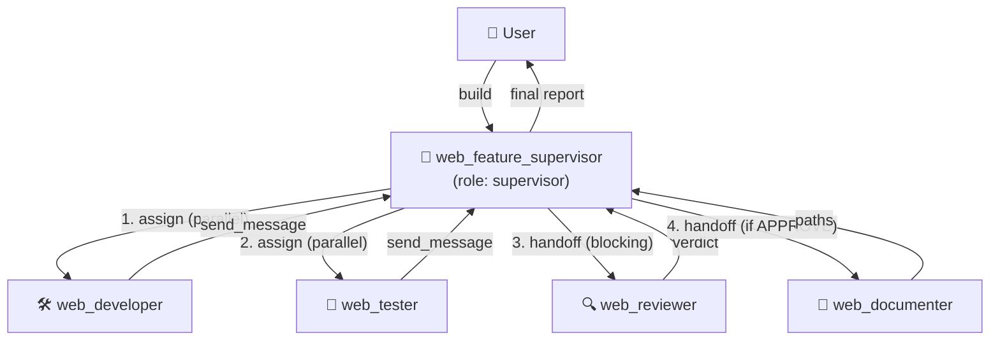

# Web Feature Build — Supervisor Template

End-to-end template that builds a CAO web UI feature with **one supervisor
coordinating four workers**, exactly the "agent chính quản lý các agents" pattern
(combines `examples/assign` + `cao-supervisor-protocols` / `cao-worker-protocols`).

## Topology



Sequence:
1. Supervisor `assign`s **developer + tester** in parallel, then ends its turn.
2. Worker results arrive in the supervisor's inbox when it goes idle.
3. Supervisor `handoff`s **reviewer** (blocking) — re-loops a fix if `REQUEST CHANGES`.
4. On `APPROVE`, supervisor `handoff`s **documenter**, then synthesizes the report.

## Files

| File | role | Purpose |
|------|------|---------|
| `web_feature_supervisor.md` | supervisor | Orchestrates the whole flow |
| `web_developer.md` | developer | Implements the feature |
| `web_tester.md` | developer | Writes/runs tests |
| `web_reviewer.md` | reviewer | 5-dimension read-only review (adapted from `addyosmani/agent-skills` → `agents/code-reviewer.md`) |
| `web_documenter.md` | developer | Writes/updates docs |

## Install & Run

### Option A — one-shot script (recommended, runs on a real TTY)

`agent-run` is installed at `~/.local/bin/agent-run` (on PATH) and also copied
here. It auto-starts a host-local CAO server on port **9887 with auth OFF**
(so the supervisor/workers can call the API without a session cookie), installs
all profiles, then launches the supervisor and attaches you to its tmux
terminal.

```bash
agent-run                         # provider=opencode_cli, session=web-feat
agent-run --provider codex        # pick a different provider
agent-run --session my-build      # custom session name
```

Inside the supervisor terminal, give it a task, e.g.:

```
Add a "session count" badge to the CAO web UI top header showing how many
sessions are currently listed. Keep it minimal and typed.
```

### Option B — manual

```bash
# Start the CAO server on an auth-OFF internal port for the agent flow
CAO_API_PORT=9887 cao-server --host 127.0.0.1 --port 9887

# Install all profiles
cao install examples/web-feature-build/web_feature_supervisor.md
cao install examples/web-feature-build/web_developer.md
cao install examples/web-feature-build/web_tester.md
cao install examples/web-feature-build/web_reviewer.md
cao install examples/web-feature-build/web_documenter.md

# Launch the supervisor. opencode is the reliable provider in this environment;
# override per-worker with --provider if you want a stronger model for review.
CAO_API_PORT=9887 cao launch --agents web_feature_supervisor --provider opencode_cli
```

> Note: the orchestration flow needs an auth-OFF server. Keep the public
> server (9889, with `CAO_ADMIN_PASS`) separate for the human web UI.

## Notes
- `web_reviewer` is a direct port of the `code-reviewer` persona from
  `addyosmani/agent-skills`, re-expressed in CAO's `AgentProfile` schema with
  `role: reviewer` and `cao-mcp-server` for callback delivery.
- Pin a stronger model for the reviewer if desired: add `provider:` / `model:`
  to `web_reviewer.md` (e.g. `provider: claude_code`, `model: opus`).
- The supervisor deliberately ends its turn after Phase 1 so inbox delivery
  works (see `cao-supervisor-protocols`). Do not add `sleep` loops.
