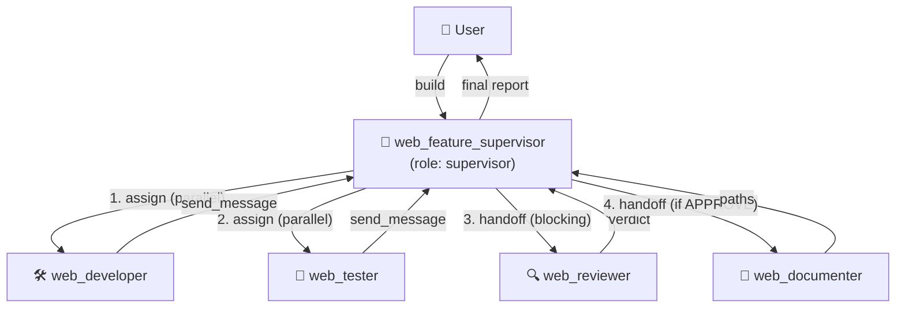

# Web Feature Build — Supervisor Template

End-to-end template that builds a CAO web UI feature with **one supervisor
coordinating four workers**, exactly the "agent chính quản lý các agents" pattern
(combines `examples/assign` + `cao-supervisor-protocols` / `cao-worker-protocols`).

## Topology



Sequence:
1. Supervisor `assign`s **developer + tester** in parallel, then ends its turn.
2. Worker results arrive in the supervisor's inbox when it goes idle.
3. Supervisor `handoff`s **reviewer** (blocking) — re-loops a fix if `REQUEST CHANGES`.
4. On `APPROVE`, supervisor `handoff`s **documenter**, then synthesizes the report.

## Files

| File | role | Purpose |
|------|------|---------|
| `web_feature_supervisor.md` | supervisor | Orchestrates the whole flow |
| `web_developer.md` | developer | Implements the feature |
| `web_tester.md` | developer | Writes/runs tests |
| `web_reviewer.md` | reviewer | 5-dimension read-only review (adapted from `addyosmani/agent-skills` → `agents/code-reviewer.md`) |
| `web_documenter.md` | developer | Writes/updates docs |

## Install & Run

### Option A — one-shot script (recommended, runs on a real TTY)

`agent-run` is installed at `~/.local/bin/agent-run` (on PATH) and also copied
here. It expects the **public CAO server on port 9889 (auth ON)** to already be
running (e.g. via systemd). The server grants a **loopback auth bypass** for
`127.0.0.1`, so the supervisor/workers can call the REST API from localhost
without a session cookie — while the public front (`agent.go7s.net -> 9889`)
still requires a login. One server, one domain. If 9889 is down, `agent-run`
starts a fallback box on 9889 itself (loopback bypass applies).

```bash
agent-run                         # provider=opencode_cli, session=web-feat
agent-run --provider codex        # pick a different provider
agent-run --session my-build      # custom session name
```

Inside the supervisor terminal, **type your feature request, then press
`Ctrl+J` to submit** (OpenCode's TUI sends the prompt on `Ctrl+J`, not Enter).
Example:

```
Add a "session count" badge to the CAO web UI top header showing how many
sessions are currently listed. Keep it minimal and typed.
```

The supervisor (`model: opus-codex`, no file tools) must immediately `assign`
the developer + tester. If it instead starts exploring the codebase, the
profile/provider is misconfigured — it has no `fs_read`/`Grep` tools by design.

### Option B — manual

```bash
# 9889 is normally already up via systemd (loopback bypass on). To run a
# standalone box instead: CAO_API_PORT=9889 cao-server --host 0.0.0.0 --port 9889

# Install all profiles
cao install examples/web-feature-build/web_feature_supervisor.md
cao install examples/web-feature-build/web_developer.md
cao install examples/web-feature-build/web_tester.md
cao install examples/web-feature-build/web_reviewer.md
cao install examples/web-feature-build/web_documenter.md

# Launch the supervisor. opencode is the reliable provider in this environment.
CAO_API_PORT=9889 cao launch --agents web_feature_supervisor --provider opencode_cli
```

> Note: with the loopback bypass, a single auth-on server (9889) serves BOTH
> the human web UI (via the reverse proxy, login required) and the agent
> orchestration (from localhost, no cookie needed). No separate 9887 required.

## Notes
- `web_reviewer` is a direct port of the `code-reviewer` persona from
  `addyosmani/agent-skills`, re-expressed in CAO's `AgentProfile` schema with
  `role: reviewer` and `cao-mcp-server` for callback delivery.
- The supervisor profile pins `model: opus-codex` and **omits file tools**
  (`fs_read`/`fs_list`/`Grep`) so it is forced to delegate rather than implement.
  If you see the supervisor grepping the codebase, the profile did not load.
- Pin a stronger model for the reviewer if desired: add `model:` to
  `web_reviewer.md` (e.g. `model: opus-codex`).
- The supervisor deliberately ends its turn after Phase 1 so inbox delivery
  works (see `cao-supervisor-protocols`). Do not add `sleep` loops.
